# 拡張機能＆ショートカットキー紹介
* * *
## 目次
1. [拡張機能一覧](#拡張機能一覧)  
1. [ショートカットキー](#ショートカットキー)
* * *

  
それぞれ知りたい拡張機能やショートカットを押すとそこに飛びます。  
  
  
* * *

## 拡張機能一覧

一覧

  
- [Color Preview](#Color-Preview)  
- [Doxygen Comments](#Doxygen-Comments)  
- [File Differ](#File-Differ)
- [Image Preview](#Image-Preview)
- [Indent Rainbow](#Indent-Rainbow)  
- [Viasfora](#Viasfora)  
- [Solution Error Visualozer 2022](#Solution-Error-Visualozer-2022)  
- [Trailing Whitespace Visualozer](#Trailing-Whitespace-Visualozer)  

## 興味のある人向け

  
一覧

  
- [Microsoft Visual Studio Installer Project 2022](#Microsoft-Visual-Studio-Instoller-Project-2022)  
- [Waka Time](#Waka-Time)  
- [Collapse Level](#Collapse-Level)  
- [Swap Selection](#Swap-Selection)  

* * *  

## Color Preview
Cssのみで使うことができる拡張機能  
色々なで記入した形式のカラーコードの横にその色を表示してくれる機能  
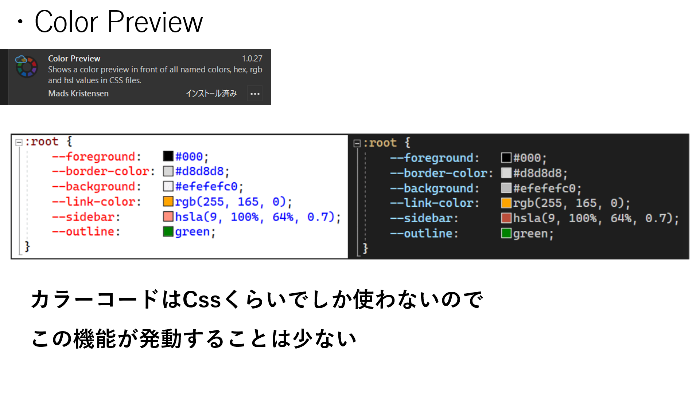
* * *
## Doxygen Comments
元々の機能であるDoxygenCommentの機能に追加して、  
自分好みに出力を変えることができるようになる。  
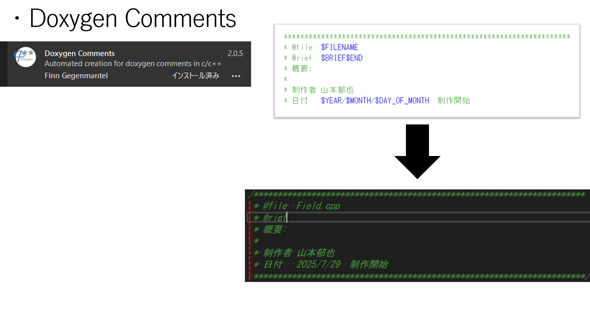
* * *
## File Differ
二つのファイルを比較して色で示してくれる機能。  
赤色のアンダーラインは右のファイルにあって左のファイルにない要素  
緑色のアンダーラインは左のファイルになくて右のファイルにある要素  
をそれぞれ明示している。  
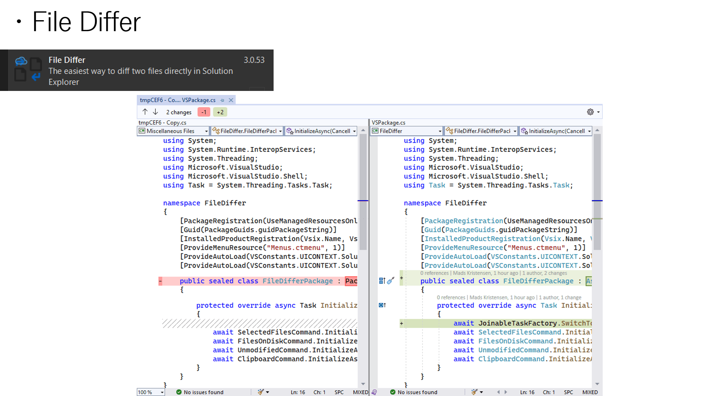
* * *
## Image Preview
テクスチャを貼るときなどに使用。  
ファイルパスを書いた場所にカーソルを当てるとそのファイルパス先の画像を表示してくれる。  
色々な形式に対応しているので便利。  
ファイルパスが違ったりスペルミスしたりしていると画像がそもそも出てこないのでエラー対策に有効。  
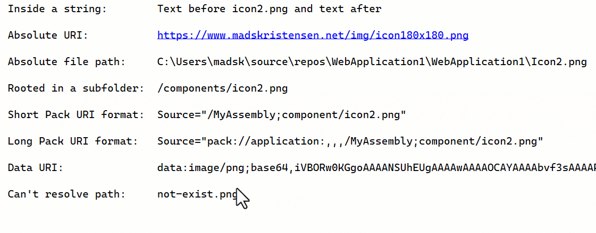
* * *
## Indent Rainbow
インデントの段階ごとに色で示してくれる。  
色の順番や表示の仕方を少しいじれる。  
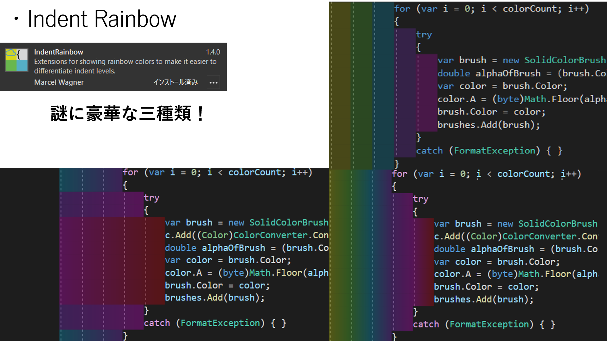
* * *
## Vias fora
括弧をその段階ごとに色分けしてくれる拡張機能。  
色の順番を変更可能。  
Ctrlキーを押しているとその括弧ないの範囲を表示してくれる。  
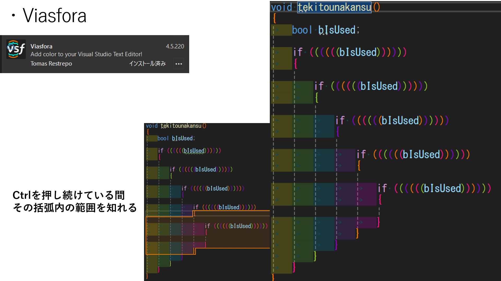
* * *
## Solution Error Visualizer 2022
エラー一覧にあるエラーをソリューションエクスプローラーで表示してくれる機能。  
どこのファイルでエラーが出たか一目でわかるので便利。  
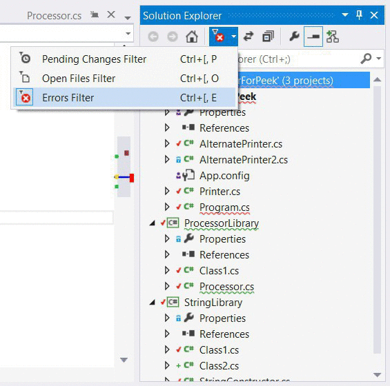
* * *
## Trailing Whitespace Visualizer
余分な空白を指定した色で明示してくれる機能。  
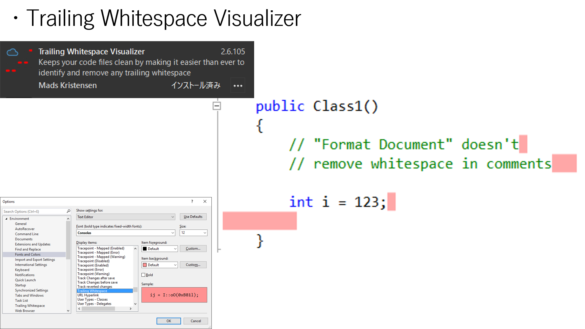
* * *
# 興味のある人用
## Microsoft Visual Studio Instoller Project 2022
インストーラーを作る事ができる拡張機能。  
詳しくは自分で調べて欲しい。[参考資料](https://yossy51.com/visual-studio-2022-%E3%81%A7%E3%82%A4%E3%83%B3%E3%82%B9%E3%83%88%E3%83%BC%E3%83%A9%E3%83%BC%E3%82%92%E4%BD%9C%E6%88%90%E3%81%99%E3%82%8B%E6%96%B9%E6%B3%95%E3%81%AB%E3%81%A4%E3%81%84%E3%81%A6/)
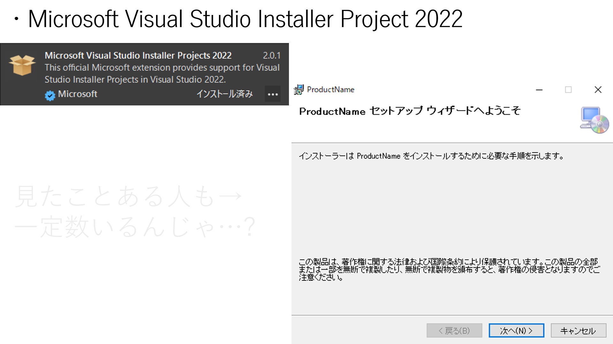
* * *
## Waka Time
どれくらいVisualStudioを触ったかが週ごとにメールで来る拡張機能。  
詳細もサイトで見ることができる。  
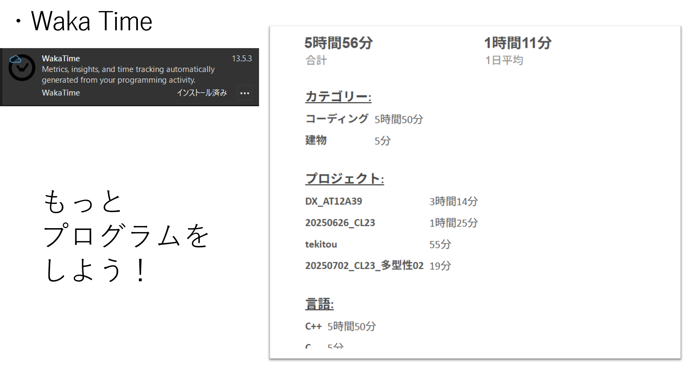
* * *
## Collapse Level
インデントのレベルごとに畳んだり開いたりできる。  
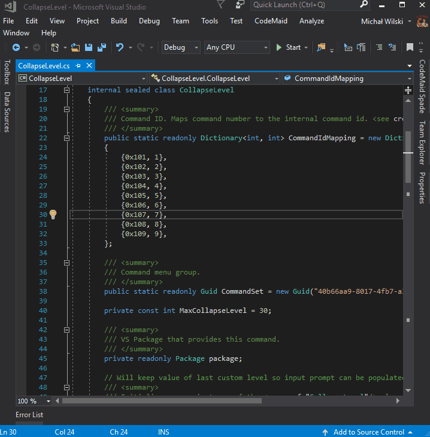
* * *
## Swap Selection
選択した二つの位置を入れ替えることができる機能。  
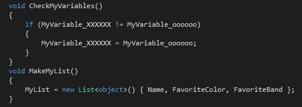
* * *

# ショートカットキー
|一覧|キー|できること|
|:----:|:----------------:|:----------------|
|1|Ctrl+D           |コピーせずコピー|
|2|Ctrl+¥→E         |エラー一覧表示|
|3|Ctrl+Alt+O       |出力の表示|
|4|Ctrl+K→Ctrl+C    |コメントアウト|
|5|Ctrl+K→Ctrl+U    |コメントアウト解除|
|6|Ctrl+Alt+L       |ソリューションエクスプローラーの表示|
|7|Shift+Ctrl+B     |ビルド|
|8|F10              |最初からブレークポイント|
|9|F11              |ブレークポイント中に関数の中を見る|
|10|Shift+Ctrl+A     |新しいファイルの追加・作成|
|11|Ctrl+R→Ctrl+R    |名前の変更|

[一番上へ](#拡張機能＆ショートカットキー紹介)  
